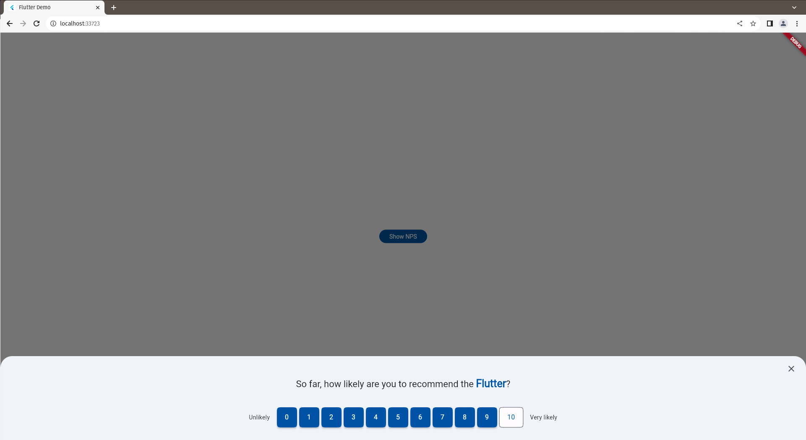
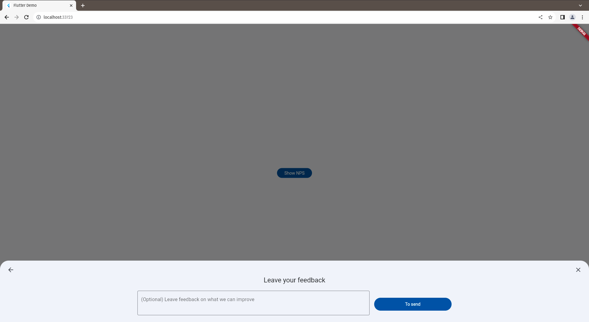

# NPS Plugin




<a href="https://opensource.org/licenses/MIT"></a>

---

Um pacote Flutter 💙 **100% nativo** para exibir uma coletar de avaliações no estilo [NPS (Net Promoter Score)](https://en.wikipedia.org/wiki/Net_promoter_score).

Este pacote permite que você mostre um modal com uma escala de avaliação de 0 a 10, bem como campos opcionais para feedback e número de telefone. Ele é compatível com plataformas web, desktop e mobile, e também suporta o tema dark.

## Instalação

Para usar este pacote, adicione `nps_plugin` como uma dependência em seu arquivo `pubspec.yaml`.

```sh
flutter pub add nps_plugin
```

Em seguida, importe o pacote em seu código:

```dart
import 'package:nps_plugin/nps_plugin.dart';
```

## Uso
Aqui está um exemplo básico de como usar o pacote para exibir o modal de avaliação NPS:

```dart
final response = await npsStart(
  context,
  npsTitle: 'Até o momento, qual é a probabilidade de você recomendar o ',
  owner: 'Flutter',
  feedbackTitle: 'Deixe as suas observações',
  showInputPhone: false,
);
```

Você pode personalizar o título, nome do sistema ou empresa e outras configurações conforme necessário.

## Compatibilidade
Este pacote é compatível com as seguintes plataformas:

- Mobile (Android e iOS)
- Web
- Desktop (Windows, macOS e Linux)

## Tema Dark
Compatibilidade com o tema dark do Flutter. Ele se ajustará automaticamente ao tema do seu aplicativo.

## Material 2 e 3
Compatibilidade com as versões 2 e 3 do Material da google.

## Contribuições e Problemas
Este pacote é de código aberto e você é incentivado a relatar problemas ou enviar sugestões de melhorias através de issues no [GitHub Issues](https://github.com/wellitonklein/nps_plugin/issues).

## Licença
Este pacote é distribuído sob a licença MIT. Consulte o arquivo LICENSE para obter detalhes.